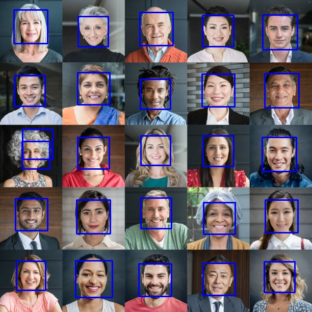
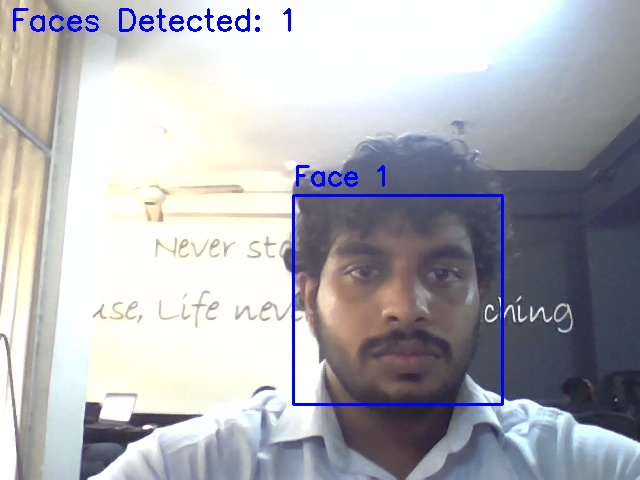

# Real-Time Face Detection using OpenCV

This project demonstrates real-time face detection using OpenCV's Haar Cascade classifier. It includes both image-based detection and webcam-based live face tracking.

## 📁 Project Structure

- `FaceDetection.ipynb`:  
  A Jupyter notebook that loads static images and applies Haar Cascade-based face detection.

- `WebcamDetection.ipynb`:  
  A Jupyter notebook that uses the device's webcam to detect and track faces in real-time.

- `haarcascade_frontalface_default.xml`:
  The pre-trained Haar Cascade classifier for frontal faces. (Download from OpenCV GitHub and place in the same directory as the script).

## 🧠 Technologies Used

- Python 3.x
- OpenCV (`cv2`)
- Jupyter Notebook

## 🚀 Getting Started

### 1. Clone the Repository
```bash
git clone https://github.com/Puliya07/opencv-face-detection.git
cd realtime-face-detection
```
### 2. Install Dependencies
Make sure you have Python and pip installed. Then install the required libraries:
```bash
pip install opencv-python jupyter
```
### 3. Run the Notebooks
Launch Jupyter:
```bash
jupyter notebook
```
Open either:
* `FaceDetection.ipynb` to test face detection on images.
* `WebcamDetection.ipynb` to run real-time face detection via webcam.  

Note: Webcam access might require proper permissions depending on your OS.

## 🧪 Sample Output
* Face Detection on Images

* Real-time Face Detection on webcam


## ✅ Features
* Fast and lightweight face detection
* Supports multiple face detection
* Real-time performance with webcam input

## 🏫 What I Learned
* Understanding of Haar Cascades as a traditional method for object detection.
* Practical application of OpenCV for loading, manipulating, and displaying images.
* Concepts of image representation (pixels, channels) and grayscale conversion.
* The importance of pre-trained models and their parameters (scaleFactor, minNeighbors, minSize).
* Basic Python scripting for computer vision tasks.
* Limitations of Haar Cascades (e.g., sensitivity to pose, lighting, occlusion) and the need for more advanced techniques in complex scenarios.

## 📌 Future Improvements
* Implement real-time detection using webcam input.
* Explore more advanced object detection methods (e.g., deep learning-based CNNs, YOLO, SSD).
* Add eye detection or other facial feature detection.
  


